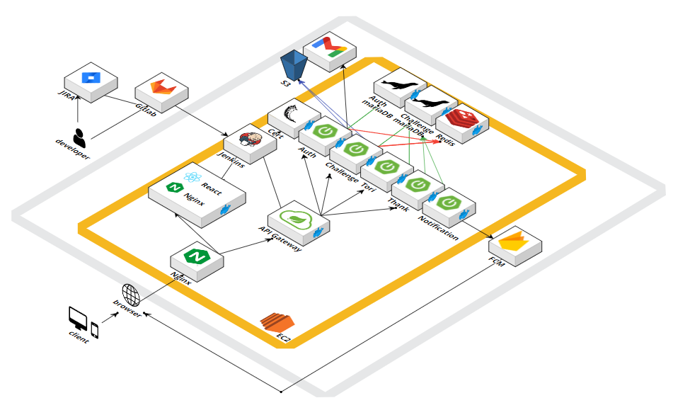

## 목차

1. [서비스 소개](#-서비스-소개)
2. [주요 기능](#-주요-기능)
3. [시스템 아키텍처](#-시스템-아키텍처)
4. [협업 툴](#-협업-툴)
5. [기술 스택](#%EF%B8%8F-기술-스택) 
   5.1 [프론트엔드](#--프론트엔드-) 
   5.2 [백엔드](#--백엔드-) 
   5.3 [인프라](#--인프라-) 
6. [팀원 소개](#-팀원-소개)

## 🍂 서비스 소개

| **소소하지만 확실한 행복을 주는 우리들의 이야기, 토리스토리!**

‘토리스토리’는 우울감을 느끼는 20대를 대상으로 소소한 도전 과제 달성을 통해 성취감 및 자존감을 높이는 것을 목표로 하는 서비스입니다.

    

    

## 🍁 주요 기능

### 1. 도전 과제

👨‍👧‍👦 <b>공동 도전</b>

- 모두 참여하는 하나의 과제로, **소속감**을 느낄 수 있습니다.
- 공동 도전에 참여하여 사진을 공유하고 다른 사람이 올린 사진을 구경할 수 있습니다.
- 완료한 참가자 수가 증가할 수록 더 많은 도토리를 얻을 수 있습니다. 

    <b> | 공동도전 참여 & 사진 공유 </b>
    <!-- 공동 도전 사진 공유 -->
    

🎲 <b>랜덤 도전</b> 

- 사진 또는 장소 인증이 필요한 랜덤한 과제로, **성취감**을 느낄 수 있습니다.
- 시스템에서 성공 여부를 판별함으로써 기능에 대한 흥미를 유발하고 인정 받는 느낌을 강화했습니다.
- 완료한 참가자 수가 증가할 수록 더 많은 도토리를 얻을 수 있습니다. 
- 랜덤 도전 갱신 티켓을 통해 다른 과제로 변경할 수 있습니다. 
    

    

    <!-- GPS 인증 -->
    <b> | GPS 인증 </b>

    
    

    

    <!-- AI 인증 GIF 넣기 -->
    <b> | AI 사진 인증 </b>
    
    <!--  -->
    

    

🕊 <b>자유 도전</b>

- 자유롭게 만들고 달성할 수 있는 과제로, **만족감**을 느낄 수 있습니다.
- 도전을 `공유`하고 스크랩하여 **다양한 경험**을 할 수 있습니다.
- 완료한 도전은 마이페이지의 달력에서 날짜를 선택하여 확인할 수 있습니다. 

    <!-- 자유 스크랩 -->
    <b> | 자유 도전 날짜 지정 스크랩 & 완료 </b>
    
    

### 2. 마이토리

🏁 <b>퀘스트</b>

- 데일리 퀘스트를 통해 다양한 기능을 이용하도록 사용자에게 **동기**를 부여했습니다.
- 모든 퀘스트를 완료하면 토토리 티켓을 얻을 수 있습니다.

<!-- 퀘스트 GIF -->

📚 <b>토리 도감</b>

- 얻은 도토리를 이용하여 다람쥐를 `수집`하여 `도감`을 채우는 **재미**를 느낄 수 있습니다.
    <!-- 토리 입양 GIF & 프로필 변경까지 넣기 -->
    <b> | 토리 입양 & 토리 프로필 변경</b>
        
    

🦊 <b>여우</b>

- 여우에게 산딸기를 주고 `따뜻한 편지`와 선물을 받을 수 있습니다.
- `긍정적 피드백`을 통해 **우울함을 완화**할 수 있습니다.
    <!-- 여우에게 먹이 주고 여우 오는거 GIF 넣기 -->
    <!-- 
 -->
    <table>
    <tr>
    <td>
    
    <b> | 여우에게 먹이 주기 </b>

    
    
    </td>
    <td>
    
    <b> | 여우에게 받은 편지 보기 </b>
    
    
    
    </td>
    </tr>
    </table>
    <!-- 
 -->
🎰 <b>토토리</b>

- 토토리 티켓을 사용하여 보상(도토리, 랜덤 도전 갱신 티켓, 토토리 티켓)을 뽑을 수 있습니다.
- 매일 1회 `무료`로 뽑을 수 있어 자주 `접속`할 **동기**를 부여합니다.
    <!-- 토토리 GIF -->
    <b> | 여우에게 받은 편지 보기 </b>
    
    

### 3. 감사 일기

💗 <b>감사 일기</b>

- 매일 `감사한 일`을 기록하며 **긍정적인 생각**을 하게 되고, 우울감을 완화할 수 있습니다.
- 마이페이지에서 작성한 일기를 확인할 수 있습니다.
- 완료한 도전은 마이페이지의 달력에서 날짜를 선택하여 확인할 수 있습니다. 
- 음성 인식을 통해 편리하게 작성할 수 있습니다. 
    

    

    <!-- 감사 일기 STT 작성 및 달력에서 확인 GIF -->
    <b> | 감사 일기 STT 작성 </b>
    
    
    

    

    <!-- 감사 일기 STT 작성 및 달력에서 확인 GIF -->
    <b> | 작성한 감사 일기 확인 </b>
    
    
    

    

## 📏 시스템 아키텍처
### [MSA]

## 💻 협업 툴

##     

  

## ⚙️ 기술 스택

### 🧷 프론트엔드

|||
|------|---------------------|
|<b>Language</b>|TypeScript|
|<b>Framework</b>|React 18.2.0|
|<b>Engine</b>|Node 18.17.1|
|<b>Library</b>|Jotai, Tailwind CSS, Axios, SWR, PWA, MUI|

          

### 🧷 백엔드

|||
|------|---------------------|
|<b>Language</b>|Java 11|
|<b>Framework</b>|Spring Boot 2.7.16|
|<b>Data(RDBMS)</b>|Spring-Data-JPA 2.7.16, MariaDB 10.11.5|
|<b>Cache</b>|Redis 2.7.16|
|<b>Build Tool</b>|Gradle|
|<b>Test</b>|Swagger 3.0.0|

   
 

### 🧷 인프라

|||
|------|---------------------|
|<b>Infra</b>|AWS EC2, Nginx|
|<b>DB</b>|H2, MySQL 8|
|<b>CI/CD</b>|Git, Jenkins|

     

  

## 🙌🏻 팀원 소개

|                                          Backend                                          |                                         Backend                                          |                                         Backend                                          |                                        Frontend                                         |                                        Frontend                                         |                                         Frontend                                         |
| :---------------------------------------------------------------------------------------: | :--------------------------------------------------------------------------------------: | :--------------------------------------------------------------------------------------: | :-------------------------------------------------------------------------------------: | :-------------------------------------------------------------------------------------: | :--------------------------------------------------------------------------------------: |
|  |  |  |  |  |  |
|                       [백아현(팀장)](https://github.com/dkgusdkfk)                        |                         [옥수빈](https://github.com/endura0535)                          |                           [이지은](https://github.com/jini11)                            |                          [김경륜](https://github.com/KimRiun)                           |                           [김예빈](https://github.com/byein)                            |                        [이채정](https://github.com/chaejeong-lee)                        |

  